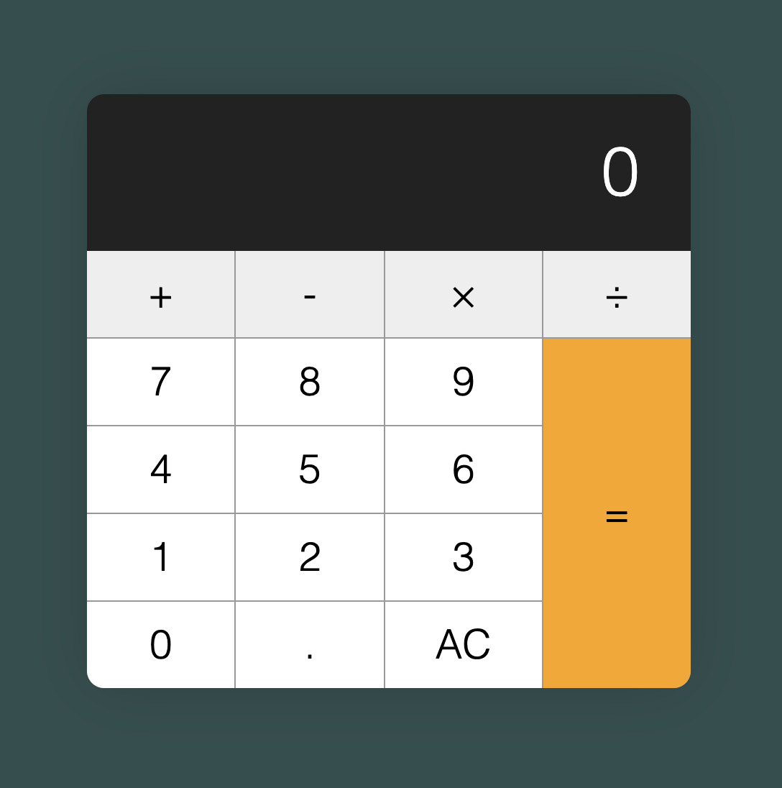

# calculator
 Creating a functional calculator following freecodecamps tutorial (not entirely, mainly for the js)

 This is for the purpose of learning how to better use javascript along with html and css, and to develop my skills
 whilst at my work placement 

 `calc.js` is just a purely console based calculator that I used to plan how the actual script.js was going to look / work

